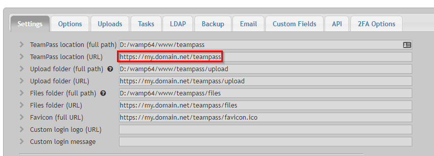
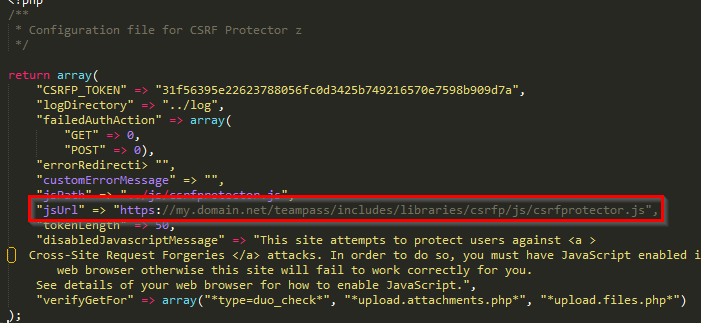
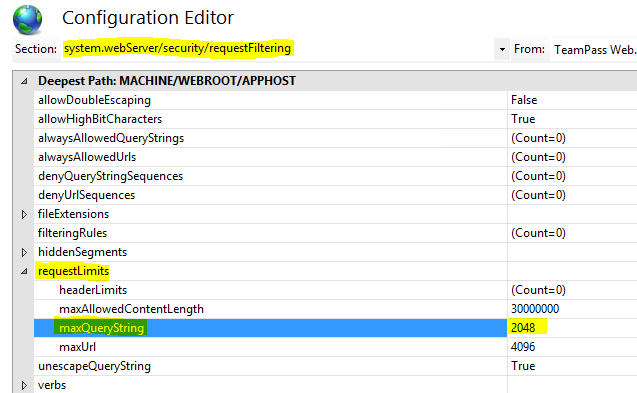

## Error 403 / 500, blank page, ...

Teampass comes with csrfProtector that protects against Cross Site Request Forgery mechanisms. Due to this, you must ensure that your Teampass configuration is consistent between all paths.

In this example, we will assume that Teampass is hosted at `https://my.domain.net/teampass`.

Check the next 2 topics and ensure consistency between the paths you are using.

### Teampass settings

* Open the `Settings` page (https://my.domain.net/teampass/index.php?page=manage_settings)
* Fill in the four (4) URL fields with the correct URL the users will use.



> Don't use any redirection. Use only the correct URL in those settings. Otherwize csrfProtector will consider this as an inconsistency and will raise an error.

### CSRFProtector settings

* With a shell, open file `<path to teampass folder>/includes/libraries/csrfp/libs/csrfp.config.php`
* Check variable `jsUrl`, it must contain the complete URL too.



## Users and Folders lists are empty

The symptom is when opening the page `Manage Users` or `Manage Folders`, the page is shown but the list is empty.

**Conditions:**

* Server is **IIS**
* Error identification shows "query string was too long"

**Solution:**

Increase the `maxQueryString` config value from 2048 (default) to **4096**. 

* Open the website in IIS Manager
* Click Configuration Editor
* Browse to the **system.webServer/security/requestFiltering** section at the top
* Click **requestLimits** in the table below
* Identify **maxQueryString** value



## Users session expires too early

The sympthom is that user session is automatically closed before the expected delay.
The user is redirected to a page that potentially indicates "Hacking attempt ...".

**Solution:**

Increase the `session.gc_maxlifetime` config value inside `php.ini` file. 

* Open in edition the file `php.ini`
* Search for variable `session.gc_maxlifetime` (in an enchanged php.ini file, the complete line is `session.gc_maxlifetime = 1440`)
* Value `1440` corresponds to a session time of 24 minutes.
* As a suggestion, set it to `7200` for a 2 hours and adapt to fit the common usage of your users.
* Restart the Apache service.

## 2 Factors Authentication QR Code picture not visible

The sympthom is that when a user is asking for a 2FA synchronization, the QR code is not displayed. 


The reason is that your firewall is blocking Google addresses.

**Solution:**

Allow in the firewall direct connectivity to 2 next destinations:

- **chart.googleapis.com** on port **443** 
- **googleapis.l.google.com** on port **443**

## Error during upgrade - PHP Fatal error: Uncaught Defuse\Crypto\Exception\BadFormatException

During upgrade, the next error is shown

```
NOTICE: PHP message: PHP Fatal error: Uncaught Defuse\Crypto\Exception\BadFormatException: Encoding::hexToBin() input is not a hex string.
```

**Solution:**

This is mostly due to the fact that you have copied the key from file `teampass-seckey.txt` into a new file on another server.

Such practice introduces new non HEX characters into the new file which makes the key to be invalid.


As a conclusion, you should not copy the key but copy the file. If you cannot then ensure to remove the HEX `0A` at the end of file.