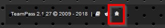
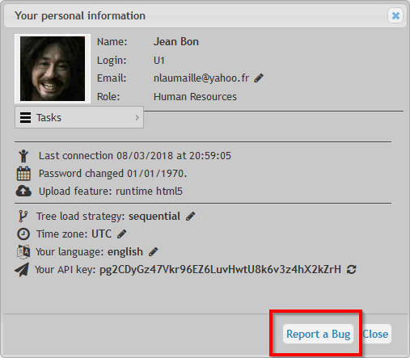
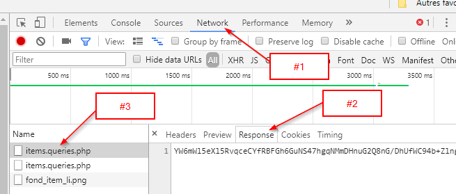

# Frequently Asked Questions

The FAQ page helps you with common questions you may have.

---

#### How to report a Bug?

Since 2.1.27(.18), it is possible to report a bug with data generated out of Teampass. Use either
* icon from Footer


* button from Profile dialogbox



In both cases, it will display the bug form. Follow instruction:


#### How to capture query error from the browser console?

In case of defect identified while using Teampass, it is recommanded to capture the query error inside the web console.
For this you need to do:

- while using your internet browser, press keys CTRL + SHIFT + i (this will open the console dialogbox)
- select tab `Network`
- select tab 'Response"
- identify the query that leads to an error
- copy the full message




#### JSON error while importing CSV file

Possible reason is the CSV file presentation.

Example of how a csv file should be structured.

```
label,login,password,url,comments
"Lo'&`égan","MyLog'an","YoupiCheap","http://www.logan.fr",""
"Logan2","MyLogan2","YoupiCheap2","http://www.logan2.fr",""
"#1866-1","MyLogan2","YoupiCheap2","http://195.218.52.38",""
"#186-2","MyLogan2","YoupiCheap2","",""
```


#### Error 500
One possible cause of an Error 500 is a bad configuration of the url in CSRFProtector library.
* Open `includes/libraries/csrfp/libs/csrfp.config.php`
* Ensure that variable `jsUrl` fits your domain and puts on csrfprotector.js file.
* Save
* Open Teampass page


#### How to set Teampass under Maintenance?
* Open `Settings` page	
* Spot `Set TeamPass in Maintenance mode` option	
* Enable it
* Save

#### I don't see the Import button

The main reason for getting a blank/white page after installation is related `include.php` file.
Follow next steps to ensure all settings are correct in this file.

* Open file `includes\include.php` with your favourite editor	

#### Why a blank page after installation?

The main reason for getting a blank/white page after installation is related `include.php` file.
Follow next steps to ensure all settings are correct in this file.

* Open file `includes\include.php` with your favourite editor	

### What should I backup?

The 3 elements to store and backup are:

* the database
* the files `teampass-seckey.txt` and `sk.php`


#### Line 14 @define('SECUREPATH', ...)

It defines the path to the secured folder you have indicated during installation.


	Be careful to not add an end slash.
	

* On a `Windows server`, it could be defined as
`
@define('SECUREPATH', 'E:\xampp\security\Teampass');
`
	
* On a `Linux server`, it could be defined as
`
@define('SECUREPATH', '/var/services/web/security/teampass');
`

#### Line 15 require_once ...

It loads the sk.php file when using Teampass.


    It is mandatory to indicate here the correct path to `sk.php` file.

* On a `Windows server`, it could be defined as
`
require_once "E:/xampp/security/teampass/sk.php";
`
	
* On a `Linux server`, it could be defined as
`
require_once "/var/services/web/security/teampass/sk.php";
`
