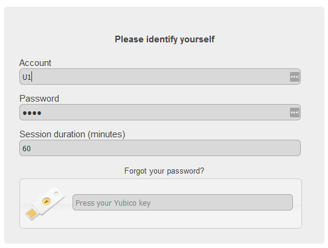
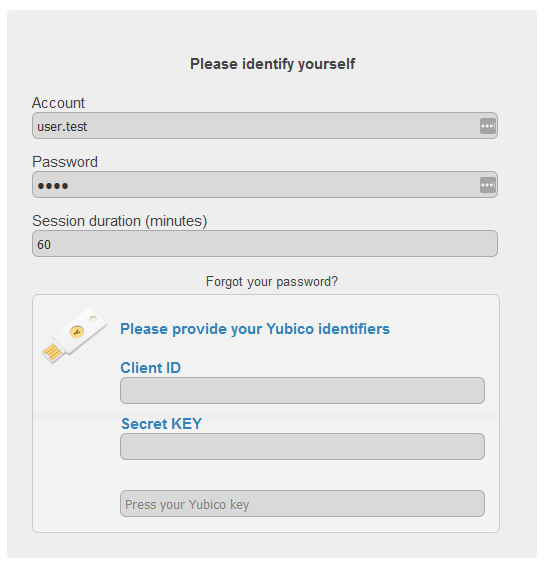
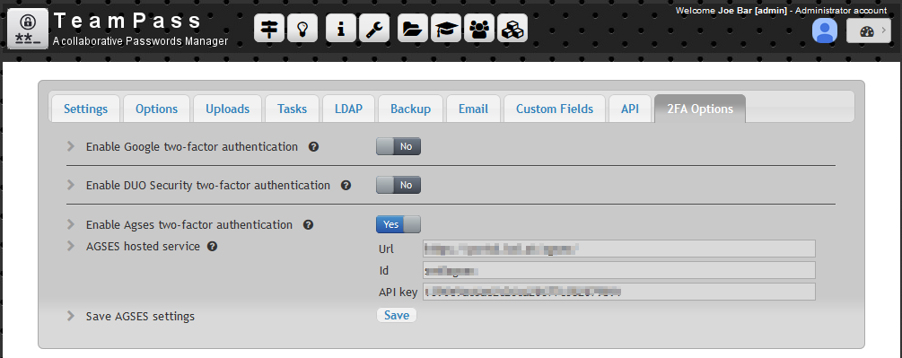
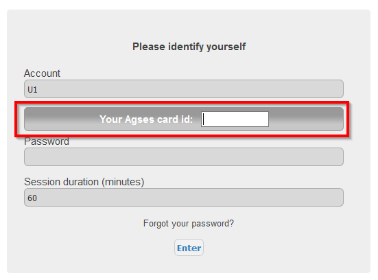
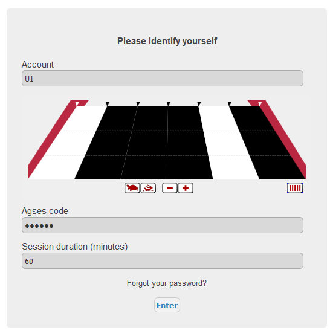
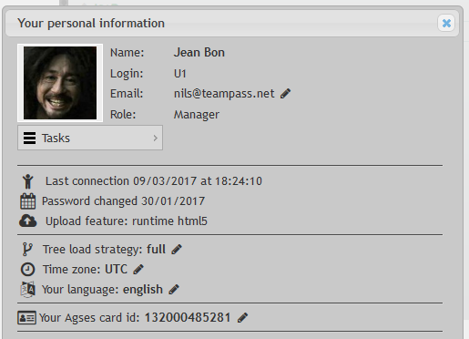

# Authentication

In order to access Teampass Items, a User has to be allowed to get connected. A User is authenticated through the usage of a `Login` and a `Password`.

The `Password` is encrypted in the database using Crypt feature which generates a hashed string using the standard Unix DES-based algorithm. The `Salt` used to generate this hash is obtained randomly with `openssl_random_pseudo_bytes` function.

It can be secured through usage of dedicated options defined here below.

# Normal access

As written previously, the initial level of authentication relies on the paired `Login` and `Password`. This means that the user needs to indicate his credentials to get connected.

	Note that 3 wrong attempts will disable the login feature for a period of 10 seconds.

# Secure login with Google Two-Factor Authentication

An option permits to enable `Google Two-Factor Authentication` to complete the initial login process.

Google Two-Factor Authentication enhances login security. When logging in, a QR code is displayed, which must be scanned into the user's Google Authentication app to receive a one-time password. 

	This requires all users to have Google Authentication application on an Internet-connected mobile device.

# Secure login with DUOSecurity

## About DUOSecurity

DUOSecurity is a two-factor authentication tool securing any kind of tool requiring a user authentication. It protects every account with ease.

For complete description, you should refer to [DUOSecurity.com](DUOSecurity.com) website.

## How does it work with Teampass?

Once enabled, this feature will require you to synchronize the accounts in Teampass and DUOSecurity. Each Teampass user login needs to have a similar input inside DUOSecurity.

When a Teampass user will require an access to Teampass, DUOSecurity will check if he/she is allowed to access and he/she will need to confirm the access through a dedicated personal device (check the [authentication methods](https://www.duosecurity.com/product/methods)). If DUOSecurity confirms the legitimacy of the user, then Teampass will allow the user to get connected.

## Define a specific application for your Teampass instance

How to create the DUOSecurity application for your Teampass instance.

 * Get connected to your DUOSecurity dashboard
 * Select `Applications` in the menu
 * Click button `Protect an Application`
 * In the list, select `Web SDK` and click `Protect this application`
 * Give a name to this application (example: Teampass)
 * The next settings could be selected:
   * `Username normalization` set to `none`
   * `New user policy` set to `Require Enrollment`
 * Click button `Save changes`
 
 Store the IKEY, SKEY and Host. You will need them in Teampass.
 
## Create the users
 
Inside the DUOSecurity interface select the Users menu and create a new user for each user you have in Teampass.
 
	You must ensure that the spelling is exactly similar.
 
 ## Enable DUOSecurity in Teampass
 
  * Login in Teampass with an Administrator account.
  * Open `Settings` page
  * Select tab `2FA options`
  * Enable `DuoSecurity` by selecting option `Yes`
  * Generate a random key for `AKEY`
  * Fill in `IKEY`, `SKEY` and `HOST` with the credentials from the application you previously created in DUOSecurity dashboard.
  * Click button `Save data in sk.php file`
  
  Now your users will have to connect by indicating their login and password, and through DUOSecurity (and especially `DuoPush` feature) to get authenticated in Teampass.

# Secure login with U2F and YUBIKO key

[yubico.com](https://www.yubico.com/)

> Introduced in 2.1.27

 ## Enable U2F in Teampass
 
  * Login in Teampass with an Administrator account.
  * Open `Settings` page
  * Select tab `2FA options`
  * Enable `Yubico` by selecting option `Yes`
  
  As a consequence, all users will have to use their credentials and associate their U2F Yubico key one time salt.
  
## Getting authenticated with U2F Yubico key

* On the home page, fill in the credentials, set focus on Yubico field and press the Yubico key

You will be automatically logged in Teampass

  
## User first connection with U2F Yubico key

The first time a user will use his U2F Yubico key, he will have to enrol it.

* A special form will be displayed asking for Yubico credentials
* Indicate your `Client ID` and `Secret Key`
* Set focus on Yubico key and press your Yubico key

This will finalize your Yubico key enrolement.

# Securize login with AGSES

[agses.net](https://agses.net/)

> Introduced in 2.1.27

## Configure AGSES at Teampass level

  * Log in to Teampass with an Administrator account.
  * Open `Settings` page
  * Select tab `2FA options`
  * Enable `AGSES` by selecting option `Yes`
   * Fill in `URL`, `ID` and `API KEY` with the credentials received from AGSES.
  * Click button `Save AGSES settings`
  

## User first loggin with AGSES Card enabled

Once enabled, any user will need his AGSES Card to get authenticated in Teampass.

If it is the first time the user get usage of his AGSES Card, a field asks him to enter his AGSES Card ID.

Then go to next step.

## User login

* Enter your login
* Use the AGSES Card to read theflicker code
* Enter the code from the AGSES Card
* Click `Enter`

> Notice that you need to validate your code in a couple of seconds.

## Changing the user AGSES Card ID

If you need to change your AGSES Card ID, open your profile and change it.

