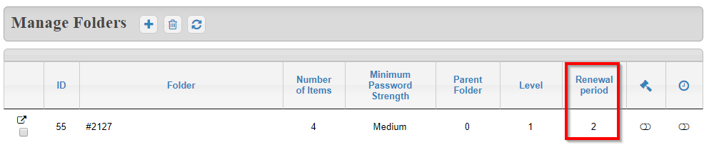
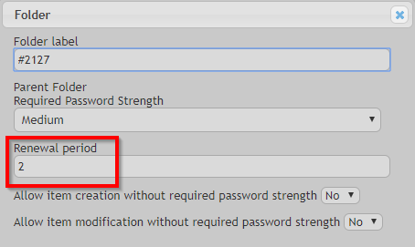
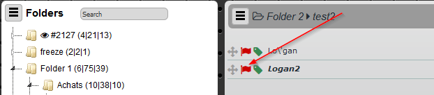
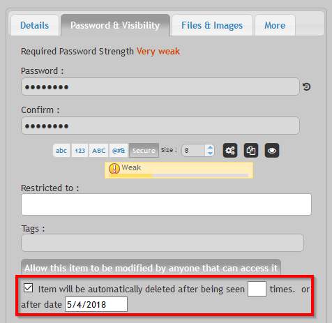
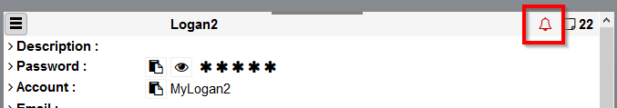

Expiration is an interesting feature permiting to limit the access to items once a specific event has been reached.

# Renewal period

Renewal permits to define a period timeframe after which passwords are considered as obsolete and need to be changed.

> As an example, we can considere that a password needs to be changed every month. By enabling this feature, Teampass will show a specific red flag in front of the Item to wanr the user about this password.

## Enable the feature

From Administrator `Settings` page, select tab `Options` and enable the option.

## Define the renewal period

The renewal period is defined in **month**.
It is set by `Folder`.

The value `0` disable it.

When editing or adding a folder, you can define this value by entering an integer.

## How to see if password Expired

When a password is expired, it is still visible.
But a `red flag` indicates this status.

# Soft delete expiration

Soft delete expiration permits to delete an item after it has been seen a certain number of times or after a specific date has been reached.

> As an example, we can considere that a password has to be deleted after 10 times being viewed or after a date. By enabling this feature, Teampass will show the item until one of the 2 criteria is reached.

## Enable the feature

From Administrator `Settings` page, select tab `Options` and enable the option.

## How to set an expiration

When creating or editing, the author may set this criteria.

## How to view if an expiration is on-going

When an expiration is on-going on an item, a little red bell will be shown when displaing the item.

## What about an expired item

When an item has expired, it is put inside the recycle bin.
An administrator or Manager can put it back.