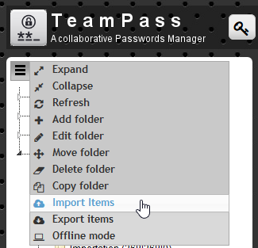
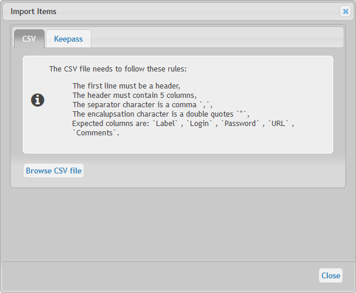
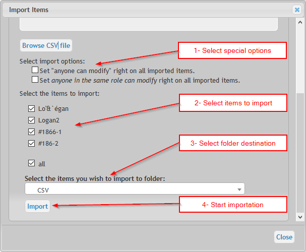
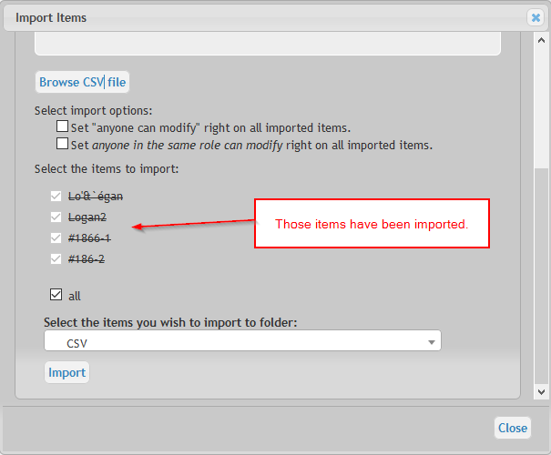

# Import new items

You may import directly items currently stored in `Excel` or `Keepass`.

## From Excel

To import Items from Excel in Teampass, the expected format is `CSV`. 

## CSV file structure

This CSV file needs to respect next rules:

* The first line must be a header,
* The header must contain 5 columns,
* The separator character is a comma `,`,
* The encalupsation character is a double quotes `"`,
* Expected columns are: `Label` , `Login` , `Password` , `URL` , `Comments`.

An example of CSV file could be:

> label,login,password,url,comments

> "Lo'&`égan","MyLog'an","YoupiCheap","http://www.logan.fr",""

> "Logan2","MyLogan2","YoupiCheap2","http://www.logan2.fr",""

> "#1866-1","MyLogan2","YoupiCheap2","http://195.218.52.38",""

> "#186-2","MyLogan2","YoupiCheap2","",""

## Start importation

1. Importation process is initiated by clicking the left-top menu button

2. Click the button `Browse` and select your CSV file

3. In the same dialogbox, the items label will be shown. You can now select:

* the Items to be imported
* the Folder destination

4. Click `Import` button

5. Imported Items will be strikethroughed in the dialogbox

6. Items are now in the destination folder

> You may perform the importation in several steps if you need to import Items in different destination folders.

## From Keepass

