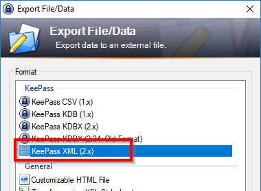
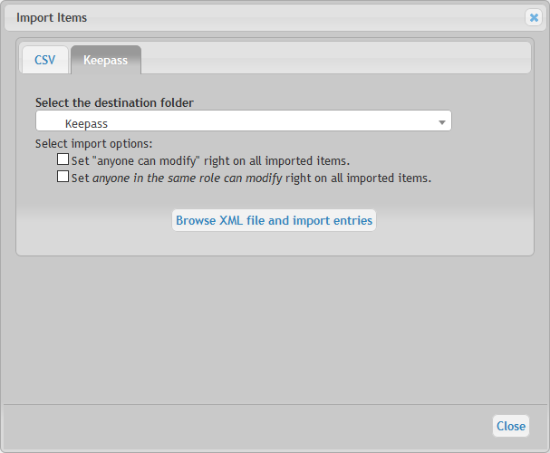
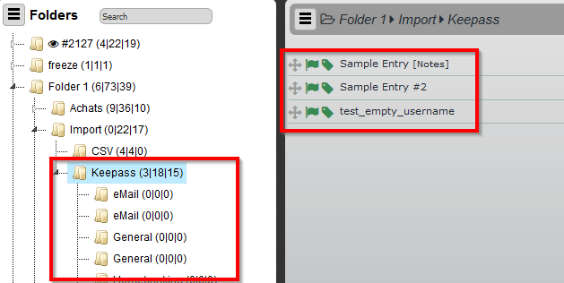
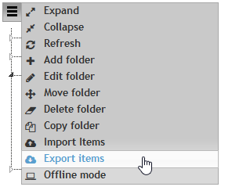
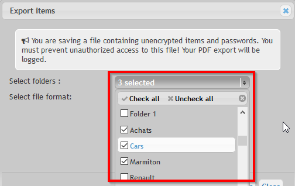
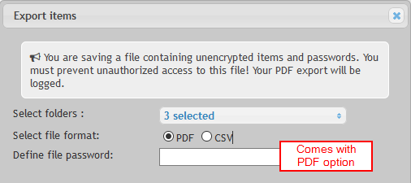
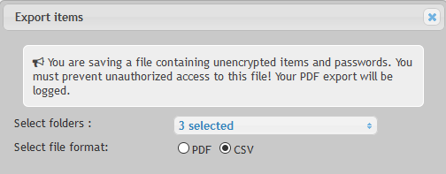
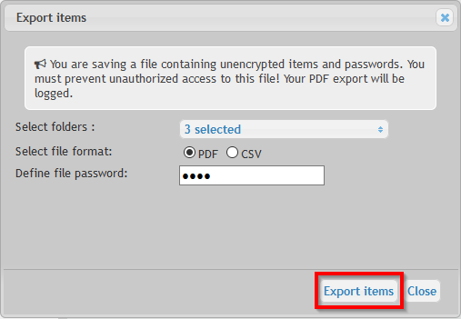
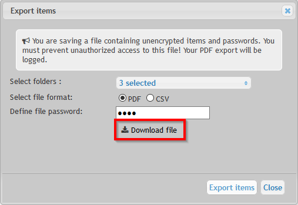

# Import new items

You may import directly items currently stored in `Excel` or `Keepass`.

	Important notice: only the Folders and Items the user is allowed to will be imported / exported.

Importation process is initiated by clicking the left-top menu button

## From Excel

To import Items from Excel in Teampass, the expected format is `CSV`. 

### CSV file structure

This CSV file needs to respect next rules:

* The first line must be a header,
* The header must contain 5 columns,
* The separator character is a comma `,`,
* The encalupsation character is a double quotes `"`,
* Expected columns are: `Label` , `Login` , `Password` , `URL` , `Comments`.

An example of CSV file could be:

   label,login,password,url,comments
   
   "Lo'&`égan","MyLog'an","YoupiCheap","http://www.logan.fr",""
   
   "Logan2","MyLogan2","YoupiCheap2","http://www.logan2.fr",""
   
   "#1866-1","MyLogan2","YoupiCheap2","http://195.218.52.38",""
   
   "#186-2","MyLogan2","YoupiCheap2","",""

### Start importation

1- Click the button `Browse` and select your CSV file

2- In the same dialogbox, the items label will be shown. You can now select:

* the Items to be imported
* the Folder destination

3- Click `Import` button

4- Imported Items will be strikethroughed in the dialogbox

5- Items are now in the destination folder

	You may perform the importation in several steps if you need to import Items in different destination folders.

## From Keepass

While importing using a Keepass file, the complete structure of Folders and Items is created in Teampass.

### Export Keepass data

Teampass uses the export format called `KeePass XML (2.x)`.

### Start importation

1- From the dialogbox, click the tab `Keepass`

2- Select the destination folder and some options related to the new imported items

> Notice that the folders and items will be created inside the destination folder

3- Click the button to browse and select your file to import

4- The importation will start immediatelly and the page will be reloaded automatically once finished

5- New folders and Items are now inside the destination folder

# Export Items

The export feature permits to export selected Items outside from Teampass.

	Notice that in this case, it is the responsibility of the user to protect the generated files.
    
    Exports are performed either in `PDF` or `CSV` files.
    

## Start export

1- Export process is initiated by clicking the left-top menu button

2- A new dialogbox will be shown. It will permit you to setup the Export

3- Select the `Folders` you wan to export

4- Select the type of export file

4.1- If selecting a `PDF` file, it is requested to add a password to secure the file

4.2- If selecting a `CSV` file, no special option is requested. Be carrefull, your passwords will be uncrypted

5- Click button`Export Items` to start the file creation

6- Once the file is ready, a link will be shown. Click it once ready

