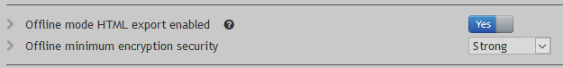
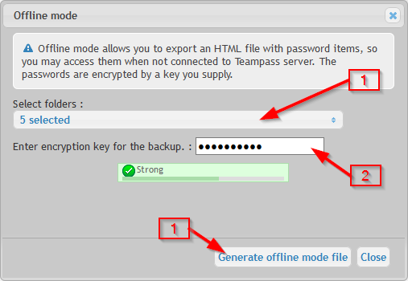
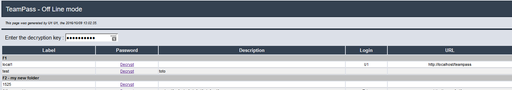

# Offline mode

Teampass can be be used in an Offline mode. In such case, it is only a `Read-only` mode.

Considere the `Offline mode` as an export of Items inside an HTML page which can be used through any kind of web-browser.

	The exported Items are encrypted using a passkey given by the User.
    
# Special option

The `Offline mode` is not enabled by default. It needs to be enabled and a minimum complexity for the passkey defined.

## Procedure

On the Items page, click the Tree menu button

Now select the Folders you want to export and the salt. Then press the button `Generate Offline mode file`.

The export is on-going. Please wait until `Download file` message appear. Notice that this sequence could take time.

Download the file and store it.

## Using the Off-line mode

Just open the downloaded file with your web browser. In the page, enter the salt you used for exporting.

The passwords are encrypted and you need to click on `decrypt` link to display the password itself. Once shown, you need to click on link `Hide` to hide the password. You can hide in one shot all the visible passwords by clicking on button `Hide all`.
