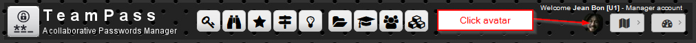
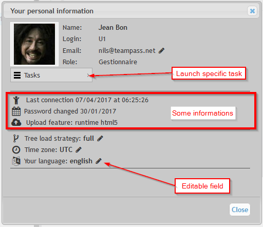
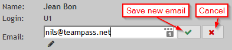
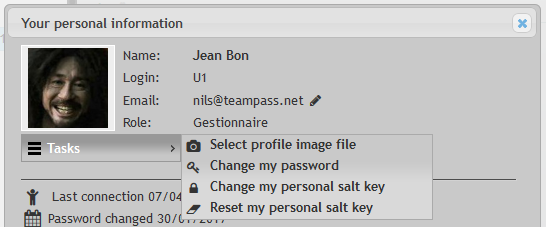
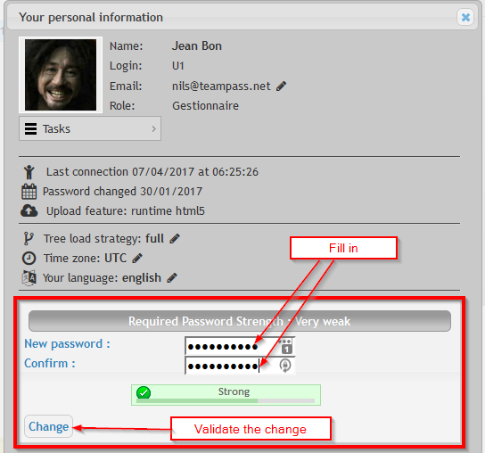
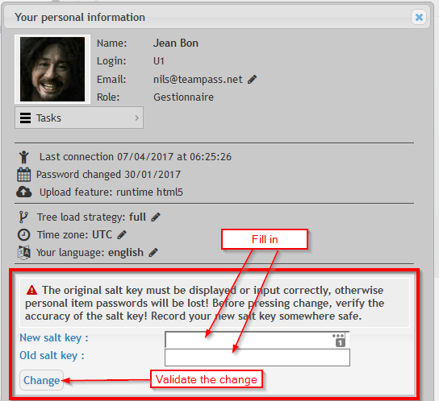
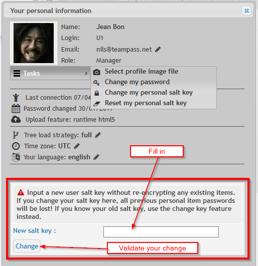

# User Profile

The `User Profile` dialog box is used to define a User's settings. Those settings are only applied on the User's account.

The dialog box is as below.

# Editable parameters

As a User, it is possible to edit and change the next parameters.

## Email address

Click the `pen icon` at the left of the current email address. Do as explained below.

## Tree load strategy

Decide if you want to load the folders Tree in `Full` or `Sequential` way.

`Full` loads the complete folders Tree in one step (this is the default recommended setting).

`Sequential` loads the folders Tree when user selects a folder (this is the recommended setting for large Trees).

## Time zone

Select the `Timezone` corresponding to your localisation.

## Language

Permits the User to define the language to use in Teampass.

> Note that you can participate to the translation of Teampass using [Poeditor](https://poeditor.com/projects/view?id=16418).

# Running Tasks

Tasks are useful to perform specific actions.

## Change Avatar

From Tasks menu, select `Select profile image file` option, and follow instruction.

This will load the new image file (jpg or png files) as your Avatar.

## Change Password

> This task permits you to change the password you are using to get logged in Teampass.

From Tasks menu, select `Change password` option, and follow instruction below.

## Change Personal Saltkey

> This task permits you to change your personal saltkey.
    
Remember that the personal saltkey permits you to encrypt your personal items. This means that only this saltkey can encrypt them. No one else that you knows how to decrypt your personal items password. **So keep it safe**.

From Tasks menu, select `Change my personal saltkey` option, and follow instruction below.

Note that those fields are not masked.

When pressing the button `Change`, the encryption process of the existing personal items will start.
Be patient until the message `Done` appears. The page will then be reloaded automatically.

## Reset my Personal Saltkey

> This task permits you to Reset your personal saltkey. It shall only be used if you have lost your current personal saltkey.

From Tasks menu, select `Reset my Personal Saltkey` option, and follow instruction below.

BE CAREFUL, this task will delete your existing personal items as they are considered lost because you don't have the personal saltkey anymore.
