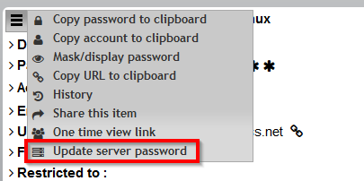
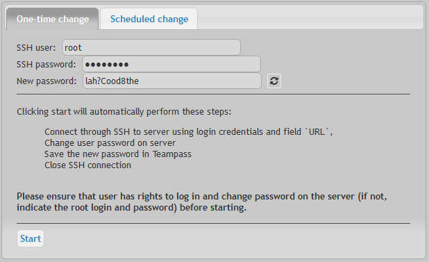
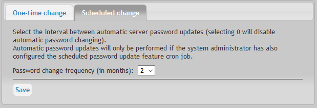

# Automatic password change on remote server

This feature permits you to change the password of a remote server (only Linux) using an SSH connection. It is enabled through the Settings page.

# Principles

It works as described below.

* Based upon field `url` starting with prefix `ssh://`, the script knows what server to connect to.
* Based upon fields `login` and `password`, the script knows what credentials to use to update the remote server.

# Steps to proceed with

In order to activate the change of password directly on the related server, you need to follow next steps:

* Display the details of the Item in Teampass
* Select option `Update server's password`

* A new dialog box will be displayed
* You can select either `One-time change` or `scheduled change`
* Enter the credentials to permit the Teampass script to get authorized through SSH
* Launch the change

# What will happen?

Teampass will perform the following:

* Get connected to the remote server through SSH
* Generate a new automatic complex password (if you decided to go on with automatic mode)
* Launch a Linux command to change the password of the user
* Close SSH connection
* Store the new password in database (if you decided to go on with automatic mode)