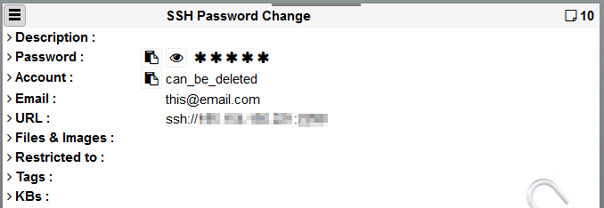
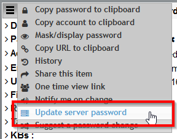
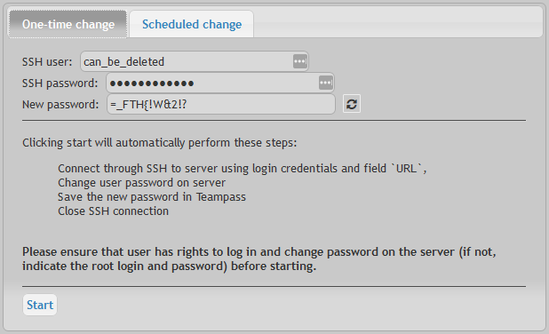
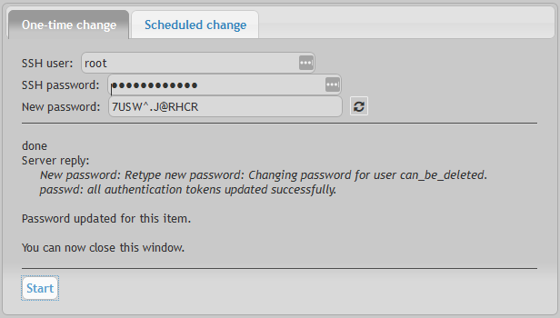

# Automatic password change on remote server

This feature permits you to change the password of a remote server (only Linux) using an SSH connection. It is enabled through the Settings page.

# Principles

It works as described below.

* Based upon field `url` starting with prefix `ssh://`, the script knows what server to connect to.
* Based upon fields `login` and `password`, the script knows what credentials to use to update the remote server.

# Enable feature

Connected with an Administrator account, it is first required to enable this feature.

Select page `Settings` and tab `Options`.

Then enable it.

# Do a one-shot change

	This feature permits to change a User password with a new one from Teampass.

To do this, follow next steps:

1- Select Item

You must ensure that:

- `login` is the user login on this server
- `url` is with formalism: `ssh://<ip>:<port>`

2- Select `Update server passowrd` from the Item menu

3- Select tab `One-time change`

4- If this user doesn't have the privileges on the Linux server to update his passowrd, please provide the credentials with those priviles.

5- Click `Start` when ready to perform the change

> In this previous screen capture, you can see that the SSH account used is the server root one.

# What will happen?

Teampass will perform the following:

* Get connected to the remote server through SSH
* Generate a new automatic complex password (if you decided to go on with automatic mode)
* Launch a Linux command to change the password of the user
* Close SSH connection
* Store the new password in database

# Plan a monthly change

	This feature permits to change a User password on a monthly base.

To do this, follow next steps:

1- Follow previous steps 1 and 2

2- Select tab `Scheduled change`

3- Select the automatic frequency update

4- Now it is required to update the cron tab on your Teampass server to add a task to execute daily the file `./backups/qcript.ssh.php`.
