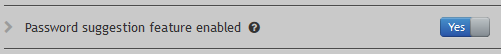
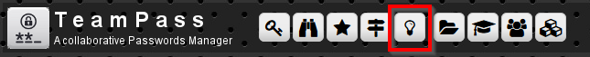
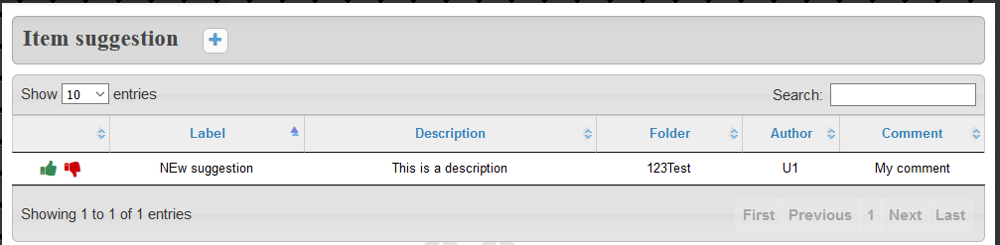
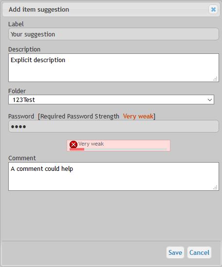
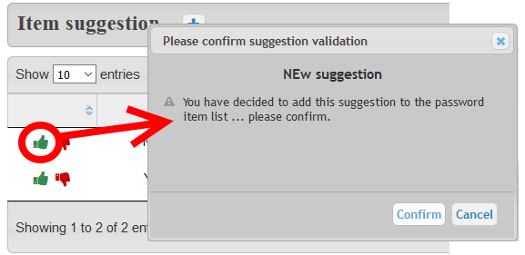
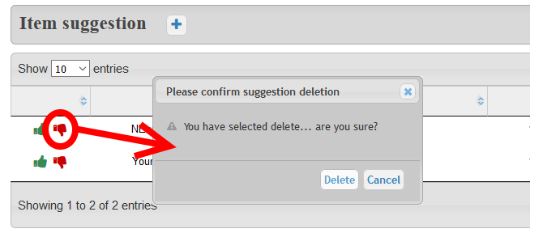

# Suggestion System

Suggestion System provides the ability to Read-Only users to suggest new Items or modification of existing ones.

# Administration - Enabling Suggestion System feature

Suggestion System is disabled by default. 

In order to activate it, an Administrator needs to enable the feature through the Teampass Settings page.

# Description

As shown in the next screen-capture, the Suggestion System page is accessed using a specific Icon in the top menu bar.

> This icon is only available for `Read-Only`, `Manager` and `Administrator` users.

# Main page

It is a classical table view that permits you to quickly identify the existing suggestion and to create new suggestions.

# Adding a Suggestion

New Suggestion is done using the `Add Button`.
The Suggestion definition is done through the next form.

The next fields are used:

* `Label` is the Item label
* `Description` is the Item Description
* `Folder` indicates in what folder the Suggestion should be added
* `Password` is the Item Password
* `Comment` permits the originator of the Suggestion to give some inputs to the Validator

# Suggesting a modification of an existing Item

If the read-only user wants to suggest a modification, it is mandatory to:

* Use the **exact label of the existing Item**
* Select the **exact folder where the existing Item is stored**

Indeed, when a Suggestion is validated, Teampass checks if an existing Item already exist by using those 2 fields.

# Validate a Suggestion

Only a `Manager` or an `Administrator` can validate a Suggestion.

For this use the `thumb up icon` in front of the Suggestion you want to validate and to confirm your choice.

# Delete a Suggestion

Only a `Manager` or an `Administrator` can delete a Suggestion.

For this use the `thumb down icon` in front of the Suggestion you want to delete and to confirm your choice.

