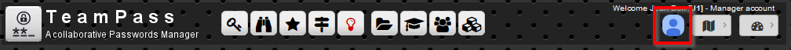
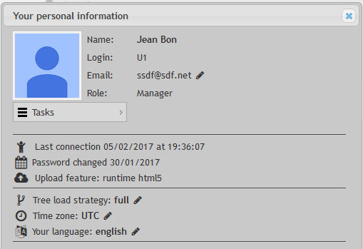
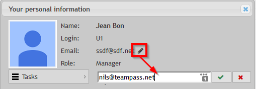
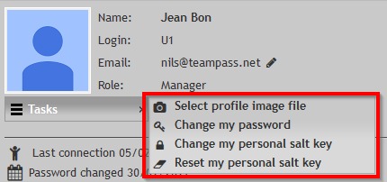
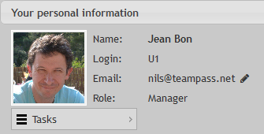
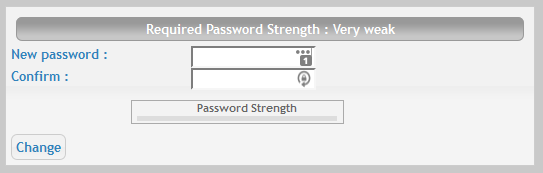
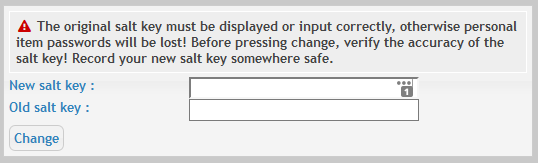
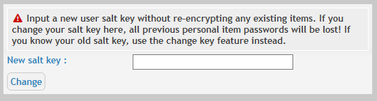

# User Profile

It gives each Teampass user the availability to define some specific settings related to his usage of Teampass.
To access your Profile, click on the Avatar in the top menu bar.

The dialog-box looks like the next screenshot.

# Inline changes

Several settings can be changed easily, just by clicking the pen icon of the setting.

For example:

## Tree Load Strategy

Permit to decide if the Folders Tree is loaded in one time, or sequentially.

If you have a big tree, it could be interessant to select the `sequential` mode for performance reasons.

## Time zone

Permits to adapt the time related to your own timezone.

## Language

Select the language used by Teampass.

# The Tasks

Using the Profile dialog-box, you can also perform the next tasks.

## Changing your Avatar

Select this option and select a file with your avatar (must be an image format `PNG` or `JPG`).

## Changing your password

You may change your password. Fill in the form and validate your choice.

It will be requested once you will have get unlogged from Teampass.

## Changing your Saltkey

You may change your Saltkey for your personal Items.

For this, you need to enter the current Saltkey and the new one.

By clicking the button `Change`, a script will update all your personal Items with the new saltkey. THis may take a couple of minutes if you have a lot of Items to be re-encrypted.

## Reseting your Saltkey

In case you have lost your saltkey, you will need to reset it.

This means that you will loose all the passwords related to your personal items. Indeed there is no possible way to retreive them as the user is the owner of the Saltkey.

Reseting will permit to allow the user to restart defining the passwords.

