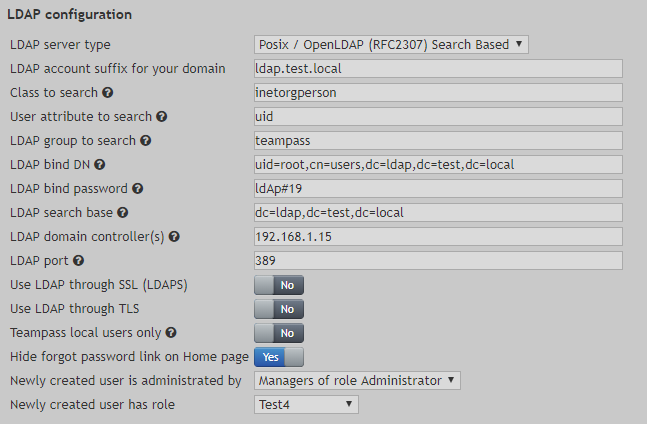

# LDAP configuration

Users authentication can be done through LDAP.

Teampass proposes the next setups:
- Windows / Active Directory
- Posix / OpenLDAP (RFC2307)
- Posix / OpenLDAP (RFC2307) Search Based

This page describes the setup using `Posix / OpenLDAP (RFC2307) Search Based`.

The next settings form is given as an example

This should be adapted to fit your LDAP server configuration

## Settings

`LDAP account suffix for your domain`
> Using the LDAP server FQDN prefixed with @ symbol.
In our case the FQDN is `ldap.test.local`.

`Class to search`
> Use inetorgperson.

`User attribute to search`
> Use the attribute used in your ldap server to identify users.

`LDAP group to search`
> Is optional. Leave it empty if any

`Class to search`
> Use 

`Class to search`
> Use 
