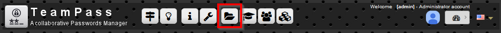
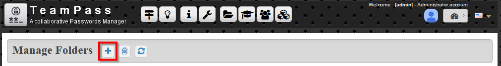
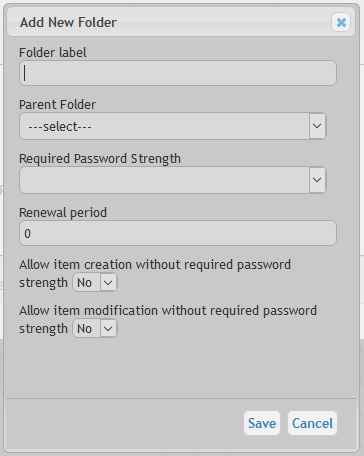
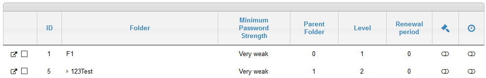
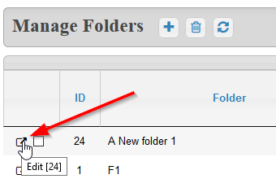
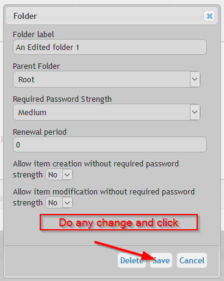
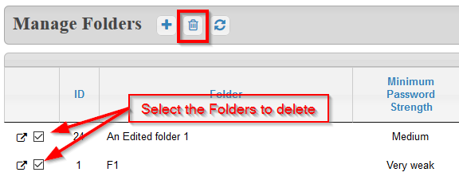

# Manage the Folders

A Folder is a container for Items. All Folders are organized in a hierarchical tree like you have in a computer. Each folder can be associated to specific access rights for Users and/or Groups.

It is essential to organize the Folders in a clever way to permit an easy way to organize the access rights for your Users and Groups.

# Access to Folders Management page

Access to the `Folders Management` page.

# Create a new Folder

Click the icon `Add a Folder`

And fill in the form

About the expected fields:

* `Field 1` is the label of the folder. It will be displayed to the users.
* `Field 2` is the location of the new Folder in the existing Tree. Notice that the 1st one need to be created at Root level.
* `Field 3` is the minimum level of complexity of the passwords created in this new Folder. Notice that the a new Item will not be created if its password does not fulfil this complexity level.
* `Field 4` is the renewal period of the passwords inside this new Folder.
* `Field 5` permits to force new Items added in this folder to respect the expected `Complexity` or not.
* `Field 6` permits to force changed Items in this folder to respect the expected `Complexity` or not.

The new Folder created is now in the list.

# Edit a Folder

You can at any moment edit a folder. Click the folder you want to edit and the edition dialog-box will be shown.

# Delete a Folder

Deleting a Folder is done by
* selecting the Folder(s)
* and clicking the `Delete icon`.

If you confirm the deletion, then all Items inside this Folder will also be deleted.

	Note that deleted Folders are not really deleted but sent to `recycled bin`.
