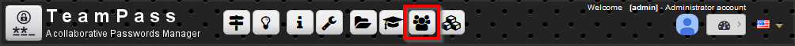
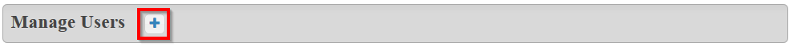
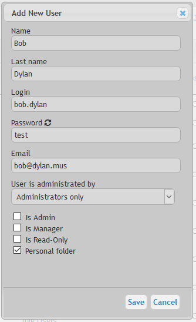
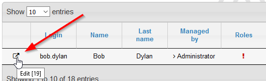
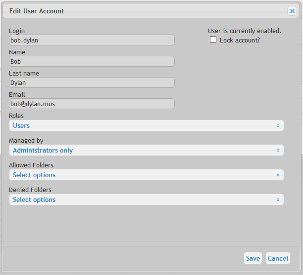
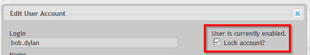
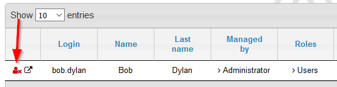
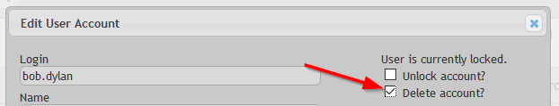
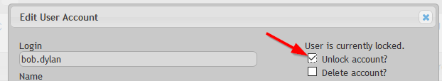
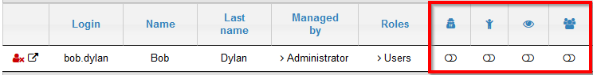

# Roles in Teampass

Teampass uses 3 roles of possible Users.

## Administrator

The Administrator has to set up Teampass to fit the expectations in term of features.
In order to achieve this goal, his role is to:

* Set the expected options
* Manage the [Folders](./manage-folders.md) (creation, modification and deletion)
* Manage the [Groups](./manage-groups.md) (creation, modification and deletion)
* Manage the Users (creation, modification and deletion)

An Administrator can perform any kind of operation in Teampass except working on Items.

The Administrator is often a member of IT team.

Notice that the Administrator has not access to the Items with his "administrator" account.

## Manager

A Manager in Teampass is a super user that can:

* manage [Folders](./manage-folders.md) (creation, modification and deletion) associated to the [Groups](./manage-groups.md) he has
* manage Users (modification and deletion) on which he is defined as "main administrator"
* of course, deal with Items

A Manager could be a Team leader.

## Human Resources

A Human Resources Manager in Teampass has the same rights as a Manager but he can manage all Users independately of his/hers group. 

Notice that he will be also promoted to Manager role, and that he will not be able to edit existing administrators.

## User

A User is a normal Teampass user which deal with Items the way defined by Administrator and Manager.

# Access to Users Management page

Access to the `Users Management` page.

# Add a new User

Click the icon `Add a User`

And fill in the form

About the form:

* `Name`, `Last name` and `Login` need to be filled in.
* The `Password` is the one the User will need to use to get connected to Teampass.
* `Email` is used to some specific feature of Teampass.
* `User is administrated by` setting is important. By default, Administrators will manage the Users, but you can also decide that this management could be delegated to the Manager of a Role. In this case, select the Role manager.
* Next 3 settings `Is admin`, `Is Manager` and `Is read only` are related the permission of the User inside Teampass. 
* If `Personal folder` is ticked, then the Personal Folder for this User will be created.
* If `Create folder and role for ***` is ticked, then you can imagine what will happen.

The new User is now added to the list.

You now need to associate this new User to Groups. Click on the `Edit icon` at the left of the User.

Perform the change you want on this User using the opening dialogbox.

With:

* `Groups` field permits you to select the Groups this user is related to
* `Managed by` field permits you to select what Manager (or Administrator) will manage this user.
* `Allowed Folders` field permits you to select Folders on which the User will have access even if not allowed with the Groups he is associated to (see next chapter for more explanations)
* `Allowed Folders` field permits you to select Folders on which the User will NOT have access even if the Groups he is associated to allows them (see next chapter for more explanations)

# Allowed and Forbidden Folders

Each user is associated to Groups. So it means, he/she can access to the Folders defined through the Group.

Nevertheless you can decide to allow this User to access other Folders than the one allowed by the Group.
For this, you need to use setting `Allowed Folders`.

You can also decide to restrict the access to some Folders using the setting `Forbidden Folders`.

	This should be very rare and for specific case. If it is regularly used, you should think about arranging your Roles.

# Lock and Delete a User

For some reason, you could need to lock a User. This will prevent the User to get connected to Teampass.

When a user is locked, a specific red icon appears at the left.

You can only `delete` a User that has been previously `locked`. For this, tick the corresponding checkbox and save.

To `unlock` a locked User, tick the corresponding checkbox and save.

# Change the User role

You can change the User level by using the selectors.

The Users Levels are:

* `Is Admin`: tick (1) to change the User to Administrator
* `Is Manager`: tick (2) to change the User to Manager
* `Is Read Only`: tick (3) to change the User to become Read Only
* `Is Human Resources`: tick (4) to change the User to Human Resources Manager

# Special actions

Using the selectors, you can also perform quickly the next action on a User.

* Allow to `create folders on Root level`
* Change the `Password`
* Change the `Email`
* See the `Log`
