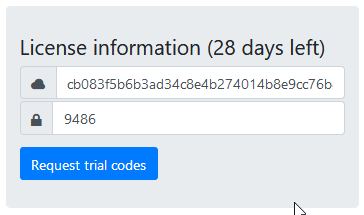
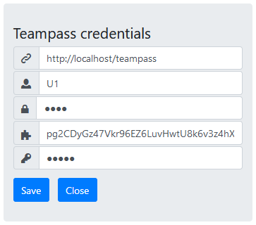

## Installation

TeampassConnect has to be installed as any web browser extension/addon.

For Firefox users:

1. Download TeampassConnect XPI file locally
2. Click the menu button  and choose  Add-ons. The Add-ons Manager tab will open. 
3. Drag and drop TeampassConnect XPI file and follow instructions

## Set up connection to Teampass

TeampassConnect needs:

- a valid license usage
- the credentials of a valid User in Teampass server with a valid Teampass API key

To setup TeampassConnect:

- Click the icon 
- Select Settings button 

### Enter license

Enter the Key and the Code

In case you don't have any license yet, click on `Request trial codes` and fill in the form.

> A valid email is required to receive your license.

### Enter User Credentials

For this step use your Teampass user credentials and fill in the the form with expected information.

> All fields are mandatory except `Personal Saltkey`

