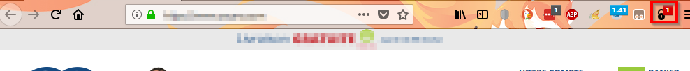
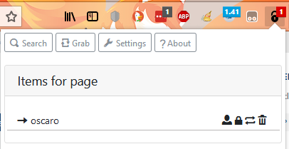
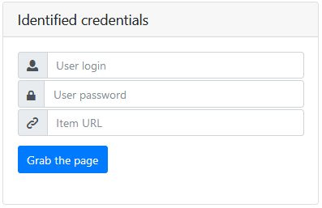
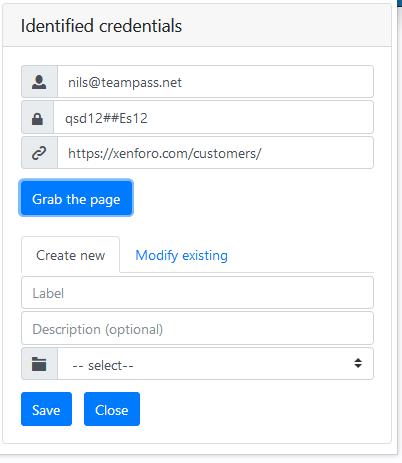

# Usage

## Basic usage

TeampassConnect has the ability to identify the website you are currently browsing and provide you the list of Items from Teampass database that could fit it.
This presents the advantage to automatically fill in the login form.

> Please notice that this feature uses the field `URL` filled inside Teampass's Items.

When browsing a website, TeampassConnect will show a badge indicating the number of Items related to it.

Click the icon  and see the Items list

## Interact with a website login form

Each Item is associated with a set of 4 icons 

 - Copy the `LOGIN` inside the clipboard

 - Copy the `PASSWORD` inside the clipboard

 - Paste the `LOGIN` and `PASSWORD` in a login form on the website

 - Delete the Item from Teampass database

## Perform a Search

You can perform a search inside the Items in Teampass database. This is an easy way to open any websites for which you have Credentials defined in Teampass database.

- Click the icon  
- Click button  
- Fill in your search criteria
- Press key `ENTER`
- The list of matching Items is shown

If an Item has an `URL`, the icon  is visible.

By clicking it, a new tab will be open in your browser using the Item url.

## Grab credentials

Grab feature permits you to `ADD` a new Item in Teampass database with the crendetials indicated inside the website login form, or to `EDIT` an existing one.

Once you have filled in the website login form, do:

- Click the icon  
- Click button  
- The grab form will be shown
 
- Click button `Grab the page`
- Find credentials will be displayed and also a second form
 

### Add new Item

- In the second form, select tab `Create new`
- Enter a `LABEL`
- Enter a `DESCRIPTION` (optionnal)
- Select the folder in which it will be created
- Click button `Save`

### Edit existing Item

- In the second form, select tab `Modify existing`
- Select the Item you want to edit. Here TeampassConnect will only show the Items whose `URL` points on this website.
- Click button `Save`